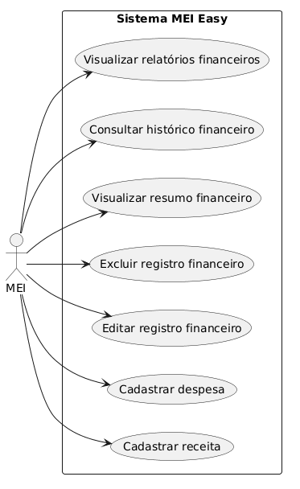
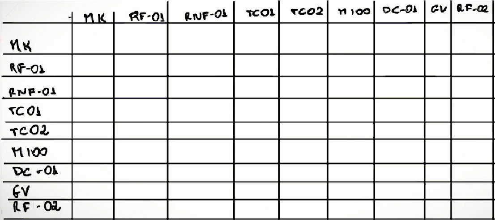
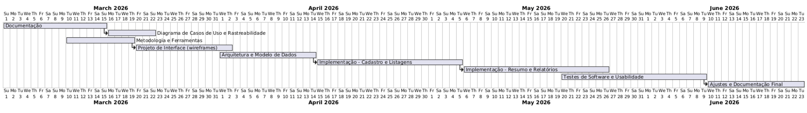
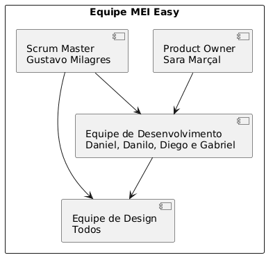

# Especificações do Projeto

Pré-requisitos: <a href="01-Documentação de Contexto.md"> Documentação de Contexto</a>

Nesta seção são apresentadas as especificações da solução proposta para apoiar microempreendedores individuais na organização de suas finanças. Para isso, foram utilizadas técnicas de modelagem de personas, histórias de usuário, definição de requisitos funcionais e não funcionais e modelagem de casos de uso.

## Personas

### Persona 1 – MEI iniciante

**Carlos Silva**, homem de 32 anos, classe média baixa, brasileiro, mora em Belo Horizonte, MG. Possui ensino médio completo e trabalha como dono de um pequeno negócio de manutenção de celulares. Carlos abriu recentemente seu MEI e utiliza principalmente o celular para divulgar seus serviços nas redes sociais, atender clientes e receber pagamentos via PIX. Ele gosta de tecnologia e busca soluções práticas que facilitem sua rotina. É sensível a preços e prefere ferramentas simples e acessíveis. Carlos tem dificuldade para organizar as receitas e despesas do negócio, pois costuma registrar valores em anotações ou confiar na memória. Ele busca uma forma fácil de acompanhar o faturamento e entender melhor a situação financeira do seu empreendimento.

### Persona 2 – MEI com negócio estabelecido

**Juliana Ferreira**, mulher de 41 anos, classe média, brasileira, mora em Betim (MG). Possui ensino médio completo e trabalha como confeiteira, sendo proprietária de um pequeno negócio de bolos e doces há cerca de cinco anos. Juliana recebe pedidos principalmente por redes sociais e aplicativos de mensagens. Ela gosta de cozinhar, valoriza a qualidade dos produtos e busca sempre oferecer um bom atendimento aos clientes. Apesar de utilizar tecnologia no dia a dia, ainda prefere registrar pedidos e gastos em um caderno. Juliana tem dificuldade em acompanhar seus lucros e despesas mensais e gostaria de uma ferramenta simples que ajude a controlar melhor as finanças e planejar o crescimento do negócio.
  
### Persona 3 – MEI que utiliza planilhas para controle financeiro

João Paulo, homem de 36 anos, classe média baixa, brasileiro, mora em Contagem (MG). Possui ensino técnico e trabalha como eletricista autônomo prestando serviços para residências e pequenos comércios. João agenda atendimentos pelo celular e recebe pagamentos principalmente por transferência ou PIX. Ele é organizado e tenta manter controle financeiro utilizando planilhas no computador. No entanto, sua rotina de trabalho é corrida e muitas vezes esquece de registrar despesas relacionadas aos serviços, como compra de materiais ou deslocamentos. João valoriza ferramentas práticas que facilitem o registro das informações no dia a dia e que permitam acompanhar melhor seus ganhos e gastos.

## Histórias de Usuários

Com base na análise das personas, foram identificadas as seguintes histórias de usuário para orientar o desenvolvimento das funcionalidades do sistema.

### 1. Cadastro e gestão de informações financeiras

| EU COMO... | QUERO/PRECISO... | PARA... |
|-------------|------------------|---------|
| Microempreendedor (MEI) | Registrar minhas receitas | Acompanhar quanto estou faturando no meu negócio |
| Microempreendedor (MEI) | Registrar minhas despesas | Controlar meus gastos e evitar prejuízos |
| Microempreendedor (MEI) | Editar ou excluir registros financeiros | Corrigir informações cadastradas incorretamente |
| Microempreendedor (MEI) | Categorizar receitas e despesas | Organizar melhor as movimentações financeiras |

---

### 2. Acompanhamento financeiro

| EU COMO... | QUERO/PRECISO... | PARA... |
|-------------|------------------|---------|
| Microempreendedor (MEI) | Visualizar um resumo financeiro | Entender rapidamente a situação do meu negócio |
| Microempreendedor (MEI) | Visualizar o total de receitas e despesas por período | Analisar o desempenho financeiro mensal |
| Microempreendedor (MEI) | Identificar meu lucro ou prejuízo | Avaliar se meu negócio está sendo financeiramente viável |

---

### 3. Organização e planejamento do negócio

| EU COMO... | QUERO/PRECISO... | PARA... |
|-------------|------------------|---------|
| Microempreendedor (MEI) | Consultar o histórico de movimentações | Acompanhar a evolução financeira do negócio |
| Microempreendedor (MEI) | Registrar despesas relacionadas ao trabalho | Ter controle completo dos custos do serviço |
| Microempreendedor (MEI) | Acessar o sistema pelo celular ou computador | Registrar informações de forma prática no dia a dia |

---

### 4. Apoio à gestão financeira

| EU COMO... | QUERO/PRECISO... | PARA... |
|-------------|------------------|---------|
| Microempreendedor (MEI) | Visualizar relatórios simples das minhas finanças | Compreender melhor meus resultados financeiros |
| Microempreendedor (MEI) | Organizar minhas informações financeiras em um único sistema | Evitar anotações dispersas em cadernos ou planilhas |
---

## Requisitos

As tabelas a seguir apresentam os requisitos funcionais e não funcionais que definem o escopo da solução proposta. A priorização dos requisitos foi realizada com base na importância de cada funcionalidade para o funcionamento básico do sistema e para a experiência do usuário.

---

### Requisitos Funcionais

| ID | Descrição do Requisito | Prioridade | Responsável |
|----|------------------------|------------|-------------|
| RF-001 | Permitir que o usuário realize cadastro e login na aplicação | ALTA | Equipe |
| RF-002 | Permitir o gerenciamento completo de movimentações financeiras (receitas e despesas), incluindo registro, edição, exclusão e consulta com filtro por período, tipo e categoria | ALTA | Daniel |
| RF-003 | Permitir o gerenciamento completo de categorias de receitas e despesas, incluindo criação, edição, exclusão e listagem | MÉDIA | Danilo |
| RF-004 | Permitir o gerenciamento do perfil do usuário, incluindo visualização e edição dos dados da conta | MÉDIA | Diego |
| RF-005 | Permitir o gerenciamento completo de preferências da aplicação, incluindo seleção de tema (claro/escuro) e outras configurações de exibição | BAIXA | Diego |
| RF-006 | Permitir o gerenciamento completo de metas financeiras, incluindo criação, edição, exclusão e acompanhamento do progresso por categoria ou período | MÉDIA | Gabriel |
| RF-007 | Permitir o gerenciamento completo de clientes, incluindo cadastro, edição, exclusão e vinculação a receitas registradas | MÉDIA | Gabriel |
| RF-008 | Exibir dashboard com resumo financeiro do período selecionado, apresentando total de receitas, despesas, resultado (lucro ou prejuízo) e gráfico comparativo por período | ALTA | Danilo |
| RF-009 | Gerar relatório financeiro com movimentações do período, filtrável por tipo (receita/despesa) e categoria | MÉDIA | Gustavo |
| RF-010 | Permitir o gerenciamento completo de recorrências, incluindo cadastro, edição, exclusão e listagem de despesas ou receitas fixas mensais | MÉDIA | Sara |
| RF-011 | Exibir notificações e alertas ao usuário, como proximidade do limite de faturamento anual do MEI e metas próximas do limite definido | MÉDIA | Sara |
| RF-012 | Permitir o gerenciamento completo de itens de estoque, incluindo cadastro, edição, exclusão, listagem e controle de quantidade | MÉDIA | Gustavo |
| RF-013 | Permitir o gerenciamento completo de contas a pagar e receber, incluindo cadastro, edição, exclusão e acompanhamento do status de pagamento | MÉDIA | Daniel |

---

**Resumo da distribuição:**
- **Equipe** — Login/Registro (RF-001)
- **Daniel** — Movimentações (RF-002) + Contas a pagar/receber (RF-013)
- **Danilo** — Categorias (RF-003) + Estoque (RF-012)
- **Diego** — Perfil (RF-004) + Preferências (RF-005)
- **Gabriel** — Metas (RF-006) + Clientes (RF-007)
- **Gustavo** — Dashboard (RF-008) + Relatórios (RF-009)
- **Sara** — Recorrências (RF-010) + Notificações (RF-011)

Quer ajustar alguma descrição, prioridade ou redistribuir algum requisito entre os membros?

---

### Requisitos Não Funcionais

| ID | Descrição do Requisito | Prioridade |
|----|------------------------|------------|
| RNF-001 | O sistema deve possuir interface simples e intuitiva para usuários com pouca experiência em tecnologia | ALTA |
| RNF-002 | O sistema deve ser responsivo, permitindo uso em dispositivos móveis e computadores | ALTA |
| RNF-003 | O sistema deve processar requisições do usuário em até 10 segundos | MÉDIA |
| RNF-004 | O sistema deve garantir segurança básica no armazenamento das informações do usuário | ALTA |
| RNF-005 | O sistema deve manter os dados financeiros armazenados de forma persistente | ALTA |
| RNF-006 | O sistema deve permitir acesso através de navegadores web modernos | MÉDIA |
| RNF-007 | O sistema deve manter disponibilidade durante o uso normal da aplicação | MÉDIA |

## Restrições

O projeto está restrito pelos itens apresentados na tabela a seguir.

| ID | Restrição |
|----|-----------|
| 01 | O projeto deverá ser desenvolvido e entregue dentro do prazo definido para o 1º semestre letivo de 2026. |
| 02 | A solução deverá ser desenvolvida como uma aplicação móvel. |
| 03 | O desenvolvimento deve ser realizado por uma equipe de até 6 alunos, o que limita a quantidade de funcionalidades implementadas. |

## Diagrama de Casos de Uso

O diagrama de casos de uso é o próximo passo após a elicitação de requisitos, que utiliza um modelo gráfico e uma tabela com as descrições sucintas dos casos de uso e dos atores. Ele contempla a fronteira do sistema e o detalhamento dos requisitos funcionais com a indicação dos atores, casos de uso e seus relacionamentos.

### Tabela de descrição dos atores e casos de uso

| Elemento | Tipo | Descrição |
|----------|------|-----------|
| MEI | Ator | Microempreendedor individual, usuário do sistema que utiliza a aplicação para registrar e acompanhar as informações financeiras do negócio. |
| UC-01 | Caso de uso | **Cadastrar receita** – Permite ao MEI registrar entradas financeiras (receitas) do negócio. |
| UC-02 | Caso de uso | **Cadastrar despesa** – Permite ao MEI registrar saídas financeiras (despesas) do negócio. |
| UC-03 | Caso de uso | **Editar registro financeiro** – Permite ao MEI corrigir dados de receitas ou despesas já cadastrados. |
| UC-04 | Caso de uso | **Excluir registro financeiro** – Permite ao MEI remover registros de receitas ou despesas incorretos ou desnecessários. |
| UC-05 | Caso de uso | **Visualizar resumo financeiro** – Permite ao MEI ver o total de receitas, despesas e o resultado (lucro ou prejuízo) do negócio. |
| UC-06 | Caso de uso | **Consultar histórico financeiro** – Permite ao MEI acessar o histórico de movimentações financeiras registradas. |
| UC-07 | Caso de uso | **Visualizar relatórios financeiros** – Permite ao MEI visualizar relatórios simples das informações financeiras do negócio. |

As referências abaixo irão auxiliá-lo na geração do artefato “Diagrama de Casos de Uso”.

> **Links Úteis**:
> - [Criando Casos de Uso](https://www.ibm.com/docs/pt-br/elm/6.0?topic=requirements-creating-use-cases)
> - [Como Criar Diagrama de Caso de Uso: Tutorial Passo a Passo](https://gitmind.com/pt/fazer-diagrama-de-caso-uso.html/)
> - [Lucidchart](https://www.lucidchart.com/)
> - [Astah](https://astah.net/)
> - [Diagrams](https://app.diagrams.net/)

# Matriz de Rastreabilidade

A matriz de rastreabilidade é uma ferramenta usada para facilitar a visualização dos relacionamento entre requisitos e outros artefatos ou objetos, permitindo a rastreabilidade entre os requisitos e os objetivos de negócio. 

A matriz deve contemplar todos os elementos relevantes que fazem parte do sistema, conforme a figura meramente ilustrativa apresentada a seguir.

> **Links Úteis**:
> - [Artigo Engenharia de Software 13 - Rastreabilidade](https://www.devmedia.com.br/artigo-engenharia-de-software-13-rastreabilidade/12822/)
> - [Verificação da rastreabilidade de requisitos usando a integração do IBM Rational RequisitePro e do IBM ClearQuest Test Manager](https://developer.ibm.com/br/tutorials/requirementstraceabilityverificationusingrrpandcctm/)
> - [IBM Engineering Lifecycle Optimization – Publishing](https://www.ibm.com/br-pt/products/engineering-lifecycle-optimization/publishing/)

## Matriz de Rastreabilidade

A matriz de rastreabilidade permite visualizar o relacionamento entre os requisitos do sistema e outros artefatos do projeto, como histórias de usuário e casos de uso. Dessa forma, é possível garantir que todos os requisitos identificados estejam contemplados nas funcionalidades da aplicação.

| Requisito | História de Usuário | Caso de Uso | Objetivo |
|-----------|--------------------|-------------|----------|
| RF-001 – Cadastrar receitas | HU-01 – Registrar receitas | UC-01 – Cadastrar receita | Permitir controle de entradas financeiras |
| RF-002 – Cadastrar despesas | HU-02 – Registrar despesas | UC-02 – Cadastrar despesa | Permitir controle de gastos |
| RF-003 – Editar registros financeiros | HU-03 – Editar registros | UC-03 – Editar registro financeiro | Corrigir informações cadastradas |
| RF-004 – Excluir registros financeiros | HU-04 – Excluir registros | UC-04 – Excluir registro financeiro | Remover dados incorretos |
| RF-006 – Visualizar resumo financeiro | HU-05 – Ver resumo financeiro | UC-05 – Visualizar resumo financeiro | Acompanhar situação do negócio |
| RF-009 – Consultar histórico financeiro | HU-06 – Consultar histórico | UC-06 – Consultar histórico financeiro | Analisar movimentações passadas |
| RF-010 – Gerar relatórios financeiros | HU-07 – Visualizar relatórios | UC-07 – Visualizar relatórios financeiros | Apoiar análise financeira do negócio |
| RNF-001 – Interface simples e intuitiva | HU-08 – Usar sistema facilmente | Todos os casos de uso | Melhorar usabilidade do aplicativo |
| RNF-002 – Sistema responsivo | HU-09 – Acessar pelo celular | Todos os casos de uso | Permitir uso em dispositivos móveis |

# Gerenciamento de Projeto

De acordo com o PMBoK v6 as dez áreas que constituem os pilares para gerenciar projetos, e que caracterizam a multidisciplinaridade envolvida, são: Integração, Escopo, Cronograma (Tempo), Custos, Qualidade, Recursos, Comunicações, Riscos, Aquisições, Partes Interessadas. Para desenvolver projetos um profissional deve se preocupar em gerenciar todas essas dez áreas. Elas se complementam e se relacionam, de tal forma que não se deve apenas examinar uma área de forma estanque. É preciso considerar, por exemplo, que as áreas de Escopo, Cronograma e Custos estão muito relacionadas. Assim, se eu amplio o escopo de um projeto eu posso afetar seu cronograma e seus custos.

## Gerenciamento de Tempo

Com diagramas bem organizados que permitem gerenciar o tempo nos projetos, o gerente de projetos agenda e coordena tarefas dentro de um projeto para estimar o tempo necessário de conclusão. O gráfico de Gantt abaixo apresenta o cronograma das atividades do projeto no 1º semestre letivo de 2026.

## Gerenciamento de Equipe

O gerenciamento adequado de tarefas contribuirá para que o projeto alcance altos níveis de produtividade. Por isso, é fundamental que ocorra a gestão de tarefas e de pessoas, de modo que os times envolvidos no projeto possam ser facilmente gerenciados.

O diagrama abaixo representa a estrutura da equipe e o fluxo de comunicação no projeto.

## Gestão de Orçamento

O processo de determinar o orçamento do projeto é uma tarefa que depende, além dos produtos (saídas) dos processos anteriores do gerenciamento de custos, também de produtos oferecidos por outros processos de gerenciamento, como o escopo e o tempo.

O projeto é acadêmico e utiliza predominantemente ferramentas gratuitas. A tabela abaixo apresenta a estimativa de custos do projeto.

| Item | Descrição | Custo estimado (R$) |
|------|-----------|---------------------|
| 01 | Ferramentas de desenvolvimento (VS Code, GitHub, Trello, Figma, Draw.io – versões gratuitas) | 0,00 |
| 02 | Domínio e hospedagem (opcional; ex.: GitHub Pages, Vercel ou similar gratuito) | 0,00 |
| 03 | Equipamentos e conectividade (já disponíveis pela equipe) | 0,00 |
| 04 | Contingência / outros (eventuais custos de certificado, APIs pagas etc.) | 0,00 |
| | **Total estimado** | **0,00** |

*Observação: O orçamento considera que a equipe utiliza apenas recursos gratuitos e infraestrutura já disponível, adequado a um projeto de 1º semestre letivo.*
