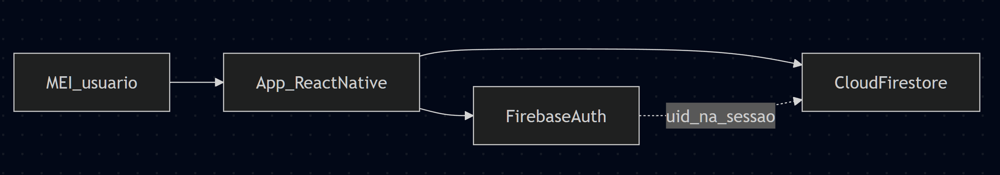

# Programação de Funcionalidades

Este documento relaciona os **requisitos funcionais e não funcionais** da solução MEI Easy à **implementação prevista** em **React Native** (aplicação móvel), com **backend e persistência em Firebase** (Authentication, Cloud Firestore e, quando necessário, **Firebase Cloud Messaging** para notificações). Para cada requisito, indicam-se os **módulos de interface**, as **operações e estruturas de dados** no Firestore e os **passos de verificação** para comprovar o funcionamento.

A referência de requisitos é a tabela atual em [Especificação do Projeto](02-Especificação%20do%20Projeto.md) (RF-001 a RF-013). Os casos de uso **UC-01 a UC-07** no mesmo documento descrevem o **núcleo** de receitas/despesas, resumo, histórico e relatórios; os RFs novos estendem esse núcleo (perfil, categorias, metas, clientes, recorrências, estoque, contas, notificações etc.).

> **Observação:** Os caminhos de arquivos de código (`src/...`) são **convencionais**; a equipe deve atualizá-los para refletir a estrutura real do repositório após o bootstrap do projeto.

> **Links úteis**
>
> - [Documentação Firebase](https://firebase.google.com/docs)
> - [Cloud Firestore](https://firebase.google.com/docs/firestore)
> - [Security Rules – Firestore](https://firebase.google.com/docs/firestore/security/get-started)
> - [Firebase Authentication](https://firebase.google.com/docs/auth)
> - [Firebase Cloud Messaging](https://firebase.google.com/docs/cloud-messaging) (alertas – RF-011)
> - [React Native](https://reactnative.dev/docs/getting-started)
> - [Expo](https://docs.expo.dev/) (opcional, se adotado para desenvolvimento e build)

---

## 1. Visão geral da implementação

O usuário (MEI) interage com o aplicativo React Native. O app utiliza o SDK do Firebase para **cadastro e login** (**RF-001**), mantém **perfil e preferências** (**RF-004**, **RF-005**) e persiste demais entidades no **Cloud Firestore** (movimentações, categorias, metas, clientes, recorrências, estoque, contas a pagar/receber). Regras de segurança garantem que cada usuário acesse apenas os seus próprios dados (**RNF-004**). O **dashboard** (**RF-008**) e **relatórios** (**RF-009**) consomem as mesmas fontes de dados das movimentações. **Notificações** (**RF-011**) podem combinar lógica no app (cálculo de limites) com **FCM** ou agendamento local, conforme decisão da equipe.



---

## 2. Modelo de dados (Cloud Firestore)

Persistência em **coleções de documentos**. Nomes e campos podem ser ajustados no código mantendo o mesmo significado. Todas as coleções listadas devem filtrar por `userId` (ou documento raiz `users/{uid}` com subcoleções) nas **Security Rules**.

### 2.1 Documento do usuário e perfil (**RF-004**)

- Coleção sugerida: `users` com ID do documento = `uid` do Authentication.
- Campos típicos: `email`, `nomeExibicao`, `telefone`, `nomeNegocio` (ou campos acordados na equipe), `criadoEm`, `atualizadoEm`.
- **RF-005:** preferências no mesmo documento (`tema: 'claro' | 'escuro'`, demais flags de exibição) ou subcoleção `users/{uid}/preferencias` com um único documento `settings`.

### 2.2 Coleção `categorias` (**RF-003**)

| Campo | Descrição |
|-------|-----------|
| `userId` | Dono da categoria |
| `nome` | Nome da categoria |
| `tipoAplicavel` | `receita`, `despesa` ou `ambos` |
| `ordem` | opcional, para ordenação na UI |
| `criadoEm` / `atualizadoEm` | auditoria |

CRUD completo na UI; exclusão deve tratar categorias em uso (bloquear ou reatribuir movimentações — definir regra de negócio).

### 2.3 Coleção `movimentacoes` (**RF-002**)

Documento por lançamento (receita ou despesa), com **consulta filtrada por período, tipo e categoria** conforme RF-002.

| Campo | Descrição |
|-------|-----------|
| `userId` | `request.auth.uid` |
| `tipo` | `receita` ou `despesa` |
| `valor` | number > 0 |
| `data` | timestamp (recomendado) |
| `descricao` | opcional |
| `categoriaId` | referência à categoria (**RF-002** + **RF-003**) |
| `clienteId` | opcional; vínculo a receita (**RF-007**) |
| `criadoEm` / `atualizadoEm` | auditoria |

Operações: criar, editar, excluir, listar com filtros (`where` em `data`, `tipo`, `categoriaId` conforme índices).

### 2.4 Coleção `clientes` (**RF-007**)

Campos sugeridos: `userId`, `nome`, `contato` (telefone/e-mail), `observacoes`, datas. Receitas em `movimentacoes` referenciam `clienteId` quando aplicável.

### 2.5 Coleção `metas` (**RF-006**)

Campos sugeridos: `userId`, `titulo`, `valorAlvo`, `periodoInicio`, `periodoFim`, `categoriaId` (opcional), `valorAtual` (atualizado por soma de movimentações ou recalculado na leitura), `criadoEm`, `atualizadoEm`.

### 2.6 Coleção `recorrencias` (**RF-010**)

Modelo de “receita/despesa fixa mensal”: `userId`, `tipo`, `valor`, `diaDoMes` ou âncora de data, `categoriaId`, `descricao`, `ativo` (boolean). A equipe pode gerar lançamentos em `movimentacoes` via job manual, Cloud Function agendada ou registro na inclusão do mês — documentar a opção escolhida no README.

### 2.7 Coleção `contas` (**RF-013** — contas a pagar e receber)

Campos sugeridos: `userId`, `tipoTitulo` (`pagar` | `receber`), `descricao`, `valor`, `dataVencimento`, `status` (`aberto` | `pago` | `cancelado`), vínculo opcional a `movimentacaoId` quando quitado.

### 2.8 Coleção `estoque_itens` (**RF-012**)

Campos sugeridos: `userId`, `nome`, `sku` (opcional), `quantidade`, `unidade`, `atualizadoEm`.

### 2.9 Notificações e alertas (**RF-011**)

- **Limite anual de faturamento MEI:** valor de referência pode ficar em **Remote Config**, constante no app ou documento `users/{uid}/config`; o app compara soma de receitas do ano civil com o limite e dispara alerta (local ou FCM).
- **Metas próximas do limite:** comparação entre progresso da meta (**RF-006**) e limiar (ex.: 80%, 100%).
- Persistência opcional: coleção `notificacoes` para histórico; ou apenas FCM + canal local.

### 2.10 Índices

Exemplos: `movimentacoes`: `userId` + `data` (desc); composto com `tipo` e/ou `categoriaId` para filtros do **RF-002** e **RF-009**. Criar índices conforme erros orientarem no console do Firebase.

### 2.11 Segurança (regras – conceito)

`request.auth.uid` obrigatório; em cada coleção, `resource.data.userId == request.auth.uid` (ou `users/{uid}` onde o path já isola o dono). Isso atende **RNF-004**.

---

## 3. Tabela de rastreabilidade (RF → UC / núcleo → app → Firebase → verificação)

| RF | Responsável (spec) | Referência UC / escopo | Módulo / tela (React Native) | Persistência / serviço Firebase | Verificação resumida |
|----|----------------------|-------------------------|------------------------------|----------------------------------|----------------------|
| RF-001 | Equipe | Pré-condição para demais RFs | **Cadastro**, **Login**, recuperação de senha (se aplicável) | `createUserWithEmailAndPassword`, `signInWithEmailAndPassword`, etc. | Novo usuário autentica e acessa área logada |
| RF-002 | Daniel | UC-01 a UC-04, UC-06 (filtros) | **Movimentações**: lista com filtros (período, tipo, categoria), formulário criar/editar, exclusão | CRUD em `movimentacoes`; queries com `where` | Filtros alteram a lista; CRUD reflete no Firestore e no dashboard |
| RF-003 | Danilo | HU categorização | **Categorias**: listagem, criar, editar, excluir | CRUD em `categorias` | Categorias aparecem nos selects do RF-002 |
| RF-004 | Diego | — | **Perfil da conta**: visualizar e editar dados | `updateProfile` (Auth) + `updateDoc` em `users/{uid}` | Dados persistem após reabrir o app |
| RF-005 | Diego | — | **Preferências**: tema claro/escuro e outras opções | `updateDoc` em `users` ou doc de preferências | Alternância de tema persiste |
| RF-006 | Gabriel | — | **Metas**: CRUD e tela de progresso (por categoria/período) | CRUD em `metas`; agregação com `movimentacoes` | Progresso coerente com lançamentos de teste |
| RF-007 | Gabriel | — | **Clientes**: CRUD; ao registrar receita, vínculo opcional | CRUD em `clientes`; `clienteId` em `movimentacoes` | Receita exibe cliente vinculado |
| RF-008 | Danilo | UC-05 | **Dashboard**: período selecionado, totais receitas/despesas, resultado, **gráfico comparativo por período** | Queries em `movimentacoes` + agregação no cliente (ou pré-agregação se usar Function) | Totais e gráfico batem com dados filtrados |
| RF-009 | Gustavo | UC-07 | **Relatório financeiro**: período, filtros tipo e categoria | Query `movimentacoes` com filtros; exportação opcional | Lista/totais coerentes com filtros |
| RF-010 | Sara | — | **Recorrências**: CRUD receitas/despesas fixas mensais | CRUD em `recorrencias`; eventual escrita em `movimentacoes` | Recorrência ativa reflete regra acordada (lançamento ou lembrete) |
| RF-011 | Sara | — | **Alertas**: proximidade limite MEI; metas próximas do limite | Leitura de totais/metas + **FCM** ou notificações locais | Disparo testável (simulação de valores ou data) |
| RF-012 | Gustavo | — | **Estoque**: CRUD itens e controle de quantidade | CRUD em `estoque_itens` | Quantidade atualiza corretamente |
| RF-013 | Daniel | — | **Contas a pagar/receber**: CRUD e acompanhamento de status | CRUD em `contas` | Mudança de status e totais por situação |

**Artefatos de código (convencionais – atualizar quando o repositório existir):**

| Área | Caminhos sugeridos |
|------|---------------------|
| Firebase | `src/services/firebase.ts` |
| Auth | `src/contexts/AuthContext.tsx`, `src/screens/auth/LoginScreen.tsx`, `CadastroScreen.tsx` |
| Núcleo financeiro | `src/screens/movimentacoes/`, `src/screens/dashboard/DashboardScreen.tsx` |
| Domínios adicionais | `src/screens/categorias/`, `clientes/`, `metas/`, `recorrencias/`, `contas/`, `estoque/`, `perfil/`, `preferencias/` |
| Tipos | `src/types/*.ts` |

---

## 4. Detalhamento por requisito funcional

### RF-001 – Cadastro e login (**ALTA**)

- **UI:** telas de registro e login; validação de e-mail/senha; mensagens de erro claras.
- **Firebase:** Authentication (e-mail/senha ou provedor definido pela equipe).
- **Verificação:** criar conta, fazer logout, login com credenciais corretas e incorretas.

### RF-002 – Movimentações financeiras completas + filtros (**ALTA**)

- **UI:** lista com filtros por **período**, **tipo** (receita/despesa) e **categoria**; formulário de inclusão/edição; exclusão com confirmação.
- **Firebase:** coleção `movimentacoes`; índices para combinações de filtro.
- **Verificação:** cenários de CRUD + filtros que excluem/incluem lançamentos esperados; vínculo opcional a **cliente** (**RF-007**) nas receitas.

### RF-003 – Categorias (CRUD + listagem) (**MÉDIA**)

- **UI:** tela de gestão de categorias; uso em selects do RF-002.
- **Firebase:** coleção `categorias`.
- **Verificação:** criar categorias distintas para receita/despesa; editar/excluir com política definida para itens em uso.

### RF-004 – Perfil do usuário (**MÉDIA**)

- **UI:** tela “Minha conta” com campos editáveis acordados.
- **Firebase:** documento `users/{uid}` e/ou metadados do Auth.
- **Verificação:** alterar nome ou campo definido e persistir.

### RF-005 – Preferências (tema claro/escuro e outras) (**BAIXA**)

- **UI:** tela ou seção de configurações; **React Native** com tema dinâmico (ex.: Context + `useColorScheme` override).
- **Firebase:** persistir preferência no Firestore para reinstalação em outro aparelho (opcional mas alinhado ao RF).
- **Verificação:** alternar tema, fechar e reabrir o app.

### RF-006 – Metas financeiras (**MÉDIA**)

- **UI:** CRUD de metas; indicador de progresso por **categoria** e/ou **período**.
- **Firebase:** `metas` + leitura agregada de `movimentacoes`.
- **Verificação:** meta com valor alvo atingível com lançamentos de teste; progresso atualiza.

### RF-007 – Clientes e vínculo a receitas (**MÉDIA**)

- **UI:** CRUD de clientes; campo “cliente” opcional ao cadastrar receita.
- **Firebase:** `clientes` + `clienteId` em `movimentacoes`.
- **Verificação:** receita vinculada aparece no detalhe/listagem.

### RF-008 – Dashboard com resumo e gráfico (**ALTA**)

- **UI:** seleção de período; cards totais receitas/despesas; **resultado** (lucro/prejuízo); gráfico comparativo (ex.: barras por semana/mês).
- **Firebase:** mesmas queries de `movimentacoes` do período.
- **Verificação:** comparar somas com planilha manual; gráfico reage ao período.

### RF-009 – Relatório financeiro filtrável (**MÉDIA**)

- **UI:** relatório por período com filtros **tipo** e **categoria**; tabela ou lista exportável (opcional).
- **Firebase:** query filtrada em `movimentacoes`.
- **Verificação:** combinações de filtro retornam subconjunto correto.

### RF-010 – Recorrências mensais (**MÉDIA**)

- **UI:** CRUD de recorrências (receita/despesa fixa mensal).
- **Firebase:** `recorrencias`; documentar se gera `movimentacoes` automaticamente ou apenas lembretes.
- **Verificação:** criar recorrência e validar comportamento acordado (lançamento ou notificação).

### RF-011 – Notificações e alertas (**MÉDIA**)

- **UI:** permissões de notificação; tela opcional de histórico/configuração de alertas.
- **Firebase / nativo:** FCM + Cloud Functions (opcional) ou **notificações locais** agendadas; lógica de proximidade do **limite MEI** e de **metas**.
- **Verificação:** teste com valores limítrofes ou ambiente de staging.

### RF-012 – Estoque (**MÉDIA**)

- **UI:** lista de itens; cadastro/edição; ajuste de **quantidade**.
- **Firebase:** `estoque_itens`.
- **Verificação:** incremento/decremento reflete no documento.

### RF-013 – Contas a pagar e receber (**MÉDIA**)

- **UI:** lista por status; cadastro/edição; marcar pago/aberto; distinção pagar vs. receber.
- **Firebase:** `contas`.
- **Verificação:** alteração de status e filtros por vencimento.

---

## 5. Requisitos não funcionais e evidências na implementação

| ID | Evidência / abordagem |
|----|------------------------|
| RNF-001 | Interface simples; fluxos guiados (cadastro → movimentação → dashboard). |
| RNF-002 | React Native em smartphones; layouts flexíveis; testar mais de um tamanho de tela. |
| RNF-003 | Feedback de carregamento; meta de resposta ≤ 10 s em rede razoável. |
| RNF-004 | Auth + Security Rules por `uid`; dados sensíveis apenas do usuário logado. |
| RNF-005 | Firestore como persistência principal. |
| RNF-006 | Restrição acadêmica: app **móvel**; acesso via navegador só se a equipe publicar **Expo Web** ou PWA — documentar o que for entregue. |
| RNF-007 | Dependência da disponibilidade do Firebase; comportamento offline (cache/fila) é opcional. |

---

## 6. Ambiente, build e verificação da implementação

### 6.1 Pré-requisitos de desenvolvimento

- Node.js (LTS), npm ou yarn.
- Android Studio / dispositivo físico; Xcode se houver build iOS.
- Projeto no [Console Firebase](https://console.firebase.google.com/): **Authentication**, **Firestore**; habilitar **FCM** se **RF-011** usar push.
- Arquivos de configuração do Firebase para React Native / Expo.

### 6.2 Execução local (exemplo com Expo)

```bash
npm install
npx expo start
```

Documentar no README os comandos reais e variáveis de ambiente (IDs do projeto, sem commitar segredos).

### 6.3 Comprovação para entrega acadêmica

- **Repositório** com README (build, credenciais de teste, escopo entregue).
- **Checklist de testes** cobrindo, no mínimo, **RF-001**, **RF-002** e **RF-008** (itens **ALTA**); demais RFs conforme divisão da equipe e cronograma.
- **Evidências:** prints ou vídeo do app + **Firebase Console** (coleções afetadas) para movimentações, dashboard e pelo menos um módulo adicional entregue.
- **Hospedagem:** APK/IPA ou build de desenvolvimento; loja não obrigatória.

---

## 7. Consistência com outros artefatos

- A **matriz de rastreabilidade** no final de [02-Especificação do Projeto](02-Especificação%20do%20Projeto.md) ainda cita numeração antiga de RFs; a **programação de funcionalidades** segue a **tabela de RFs atual** (RF-001 a RF-013). Recomenda-se atualizar a matriz no documento 02 na próxima revisão do projeto.
- [Arquitetura da Solução](05-Arquitetura%20da%20Solução.md): persistência descrita aqui é **Firestore**; alinhar diagramas de dados ao modelo desta seção.

---

*MEI Easy — 1º semestre letivo de 2026 — React Native + Firebase (Auth, Firestore, FCM conforme escopo de notificações).*
