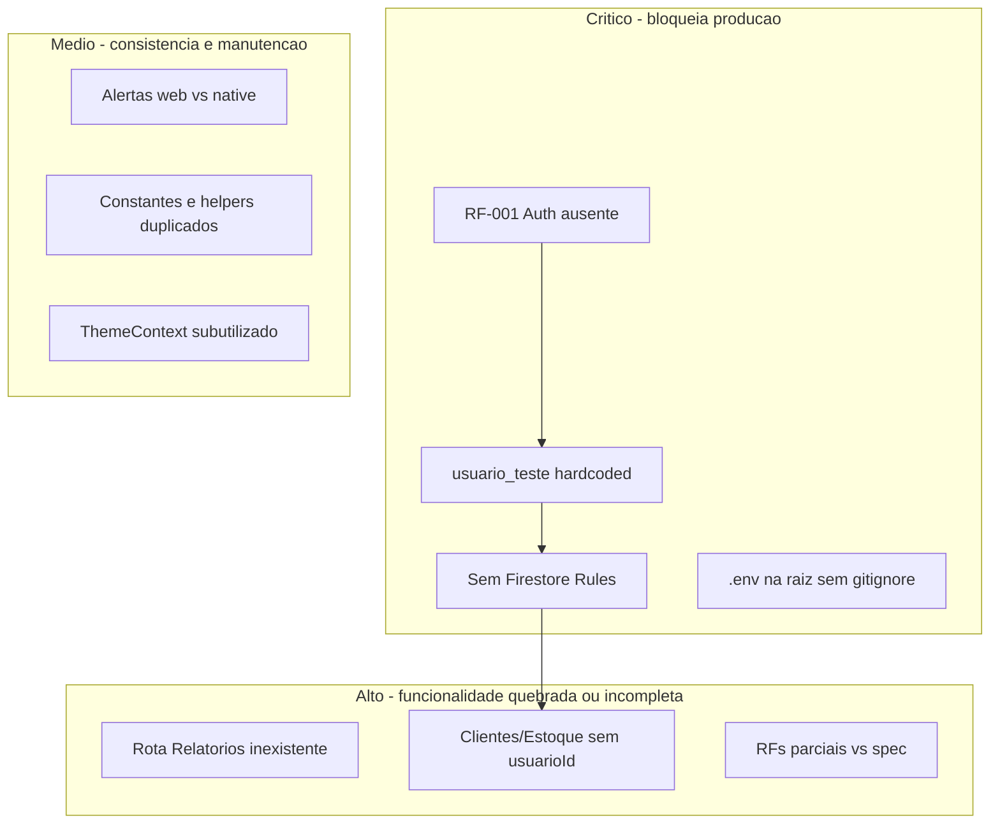

# Backlog de débito técnico — MEI Easy

Levantamento do código em [`src/app`](src/app) e documentação. Itens agrupados por **severidade**; cada um vira um card de trabalho futuro.

---

## 1. Crítico — segurança e autenticação

### TODO-01: Implementar RF-001 (login/cadastro)
- **Problema:** Não há telas de auth, contexto de sessão nem rotas protegidas. [`App.js`](src/app/App.js) só monta `ThemeProvider` + `AppNavigator`.
- **Evidência:** `getAuth` exportado em [`firebase.js`](src/app/config/firebase.js) mas nunca usado para `signIn`/`signOut`.
- **Impacto:** RNF-004 (segurança) e pré-requisito de todos os RFs conforme [`docs/07-Programação de Funcionalidades.md`](docs/07-Programação de Funcionalidades.md).

### TODO-02: Eliminar `usuario_teste` hardcoded
- **Problema:** `USUARIO_ID = 'usuario_teste'` duplicado em **7 telas**; comentário explícito de débito em [`NovaMovimentacaoScreen.js`](src/app/screens/movimentacoes/NovaMovimentacaoScreen.js) (linhas 8–9).
- **Arquivos afetados:**
  - [`ListaMovimentacoesScreen.js`](src/app/screens/movimentacoes/ListaMovimentacoesScreen.js)
  - [`NovaMovimentacaoScreen.js`](src/app/screens/movimentacoes/NovaMovimentacaoScreen.js)
  - [`ListaCategoriasScreen.js`](src/app/screens/categorias/ListaCategoriasScreen.js)
  - [`FormularioCategoriaScreen.js`](src/app/screens/categorias/FormularioCategoriaScreen.js)
  - [`ListaContasScreen.js`](src/app/screens/contas/ListaContasScreen.js)
  - [`FormularioContaScreen.js`](src/app/screens/contas/FormularioContaScreen.js)
  - [`DashboardScreen.js`](src/app/screens/dashboard/DashboardScreen.js)
- **Ação futura:** Criar `AuthContext` (ou hook `useAuth`) e usar `auth.currentUser.uid` em todos os services.

### TODO-03: Nome hardcoded na Home
- **Problema:** [`HomePage.js`](src/app/screens/screensMisc/HomePage.js) exibe `const userName = "Gustavo"` — dado fictício, não vem do perfil/auth.
- **Ação futura:** Substituir por nome do usuário autenticado (RF-004) após TODO-01.

### TODO-04: Firestore Security Rules
- **Problema:** Nenhum arquivo `firestore.rules` no repositório; docs exigem isolamento por `request.auth.uid`.
- **Risco:** Com regras permissivas no Console, todos os usuários veem dados de todos.

### TODO-05: Credenciais Firebase expostas
- **Problema:** [`.env`](.env) na **raiz** do repo; só [`src/app/.gitignore`](src/app/.gitignore) ignora `.env` — **não há `.gitignore` na raiz**.
- **Detalhe:** [`isFirebaseConfigValid()`](src/app/config/firebaseConfig.js) existe mas nunca é chamada na inicialização.
- **Ação futura:** Mover `.env` para `src/app/`, adicionar `.gitignore` na raiz, documentar rotação de chaves se já commitadas.

---

## 2. Alto — rotas quebradas e escopo de dados

### TODO-06: Rota "Relatórios" inexistente
- **Problema:** [`HomePage.js`](src/app/screens/screensMisc/HomePage.js) navega para `"Relatórios"`, mas [`AppNavigator.js`](src/app/navigation/AppNavigator.js) não registra essa screen → erro em runtime.
- **Relacionado:** RF-009 (MÉDIA) ainda não implementado.

### TODO-07: Clientes e estoque sem isolamento por usuário
- **Problema:** [`ListaClientesScreen.js`](src/app/screens/clientes/ListaClientesScreen.js) consulta coleção `clientes` inteira, sem `usuarioId`.
- **Problema:** [`addEstoque.js`](src/app/services/estoque/addEstoque.js) tem `userId` comentado; estoque é global.
- **Impacto:** Mesmo após auth, dados de clientes/estoque continuariam compartilhados.

### TODO-08: Arquivo morto `NovoClienteScreen.js`
- **Problema:** [`NovoClienteScreen.js`](src/app/screens/clientes/NovoClienteScreen.js) está **vazio** e não registrado; CRUD de clientes está todo inline em `ListaClientesScreen`.

### TODO-09: Deep linking incompleto (web)
- **Problema:** [`AppNavigator.js`](src/app/navigation/AppNavigator.js) — `linkingScreens` não inclui `Clientes`, `Estoque`, `Dashboard`; URLs web quebram para essas rotas.

### TODO-10: RFs parciais vs especificação
| RF | Estado | Débito |
|----|--------|--------|
| RF-002 | Parcial | Sem filtro por **categoria** na lista de movimentações |
| RF-004 | Ausente | Sem tela de perfil |
| RF-005 | Parcial | Toggle de tema só na Home; telas de feature ignoram `ThemeContext` |
| RF-006 | Ausente | Metas financeiras |
| RF-007 | Parcial | Clientes sem `usuarioId` e sem vínculo `clienteId` em receitas |
| RF-009 | Ausente | Relatórios (ver TODO-06) |
| RF-010 | Ausente | Recorrências |
| RF-011 | Ausente | Notificações/alertas MEI |
| RF-013 | Parcial | Status `pendente`/`pago` no código vs `aberto`/`cancelado` na spec |

Referência: [`docs/02-Especificação do Projeto.md`](docs/02-Especificação do Projeto.md)

---

## 3. Médio — consistência de código e UX

### TODO-11: Duplicação de constantes e helpers
- Paleta (`AZUL_ESCURO`, `#4fc3f7`, etc.) redefinida em cada screen.
- `formatarMoeda` / `extrairNumero` copiados em [`NovaMovimentacaoScreen.js`](src/app/screens/movimentacoes/NovaMovimentacaoScreen.js), [`FormularioContaScreen.js`](src/app/screens/contas/FormularioContaScreen.js) e [`dashboardService.js`](src/app/services/dashboardService.js).
- **Ação futura:** Extrair `constants/theme.js` e `utils/formatacao.js`.

### TODO-12: Headers e navegação inconsistentes
- Home/Estoque usam [`header.js`](src/app/components/header.js); demais telas têm header inline customizado.
- [`ListaClientesScreen.js`](src/app/screens/clientes/ListaClientesScreen.js) não tem botão voltar como as outras features.

### TODO-13: Confirmações de exclusão ad hoc
- Web: `window.confirm` em movimentações e contas.
- Native: `Alert.alert`.
- [`ConfirmModal.js`](src/app/components/ConfirmModal.js) existe mas só estoque usa — categorias podem falhar silenciosamente no web.

### TODO-14: Inicialização Firestore fragmentada
- Estoque usa `db` de [`firebase.js`](src/app/config/firebase.js).
- Movimentações/categorias/contas chamam `getFirestore(app)` localmente em cada service.
- **Ação futura:** Centralizar instância `db` exportada.

### TODO-15: Queries ineficientes
- [`getMovimentacoes`](src/app/services/movimentacoesService.js) busca **todos** os docs do usuário e filtra datas no cliente — não escala; sem índices compostos Firestore.

### TODO-16: Tratamento de erro inconsistente
- Estoque: `console.log` apenas.
- Clientes: `alert()` + `console.log`.
- Outras telas: `Alert.alert` — padrão único ausente.

### TODO-17: Naming e arquivos soltos
- `HomePage.js` exporta `HomeScreen`; `estoqueScreen.js` exporta `App`.
- Comentário de debug em [`App.js`](src/app/App.js): *"ESTA LINHA ESTAVA FALTANDO"*.
- [`FlatList` dentro de `ScrollView`](src/app/screens/clientes/ListaClientesScreen.js) — risco de performance.
- README em [`src/README.md`](src/README.md) referencia pasta `/utils` inexistente e path `cd ./app` incorreto (correto: `src/app`).

---

## 4. Baixo — melhorias futuras (não bloqueiam entrega acadêmica)

### TODO-18: TypeScript
- Projeto 100% `.js`; docs mencionam `.tsx` para dashboard — sem type safety.

### TODO-19: Validação de formulários
- Sem validação de CPF/CNPJ, e-mail ou formato de data em clientes/movimentações.

### TODO-20: Alinhar distribuição de RFs na documentação
- [`docs/02-Especificação do Projeto.md`](docs/02-Especificação do Projeto.md) lista RF-008 como Danilo e RF-009 como Gustavo, mas resumo da equipe inverte Dashboard/Relatórios — revisar atribuições para evitar confusão.

---

## Ordem sugerida de execução (quando sair do plan mode)

1. **TODO-05** — Proteger `.env` (rápido, alto impacto)
2. **TODO-01 + TODO-02 + TODO-04** — Auth + substituir `usuario_teste` + Rules (núcleo de segurança)
3. **TODO-03** — Nome real na Home (depende de auth/perfil)
4. **TODO-06 + TODO-10 (RF-009)** — Corrigir rota ou implementar Relatórios
5. **TODO-07 + TODO-08** — Escopo clientes/estoque + limpar arquivo morto
6. **TODO-11 a TODO-17** — Refatoração incremental (pode ser paralelizada entre membros)
7. **TODO-18 a TODO-20** — Backlog de qualidade / docs

**Estimativa:** TODOs 1–5 são pré-requisito para qualquer uso multi-usuário real; TODOs 6–17 podem ser divididos por módulo (movimentações, contas, estoque, etc.) conforme divisão atual da equipe.
